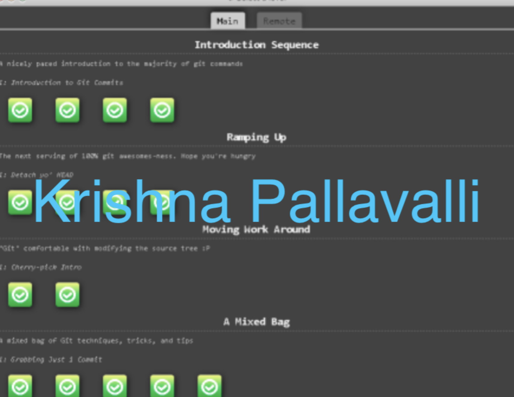
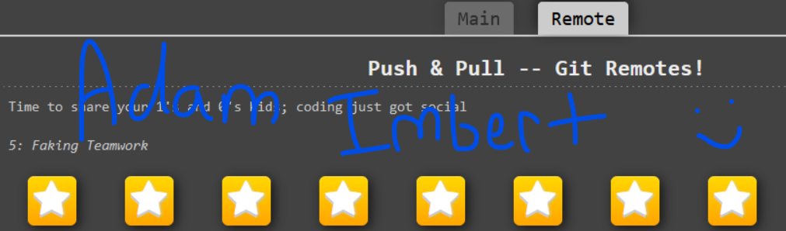

Info\


\
GitHub Activity\


## Introduction
A code repository for learning to use git version control, GitHub Issues and best practices, and so on.

Created as part of homework 2 for CSC 510: Software Engineering.
### Contributors (Group 15)
- Adam Imbert (apimbert)
- Hanqi Chen (hchen54) 
- Krishna Pallavalli (kpallav)

[**Team HTML page**](https://csc-510-group-15.github.io/git-homework2/)
## Image

Krishna Pallavalli (kpallav):




Hanqi Chen (hchen54):


Adam Imbert (apimbert):



## Code Example
```
# Stage all changes for commit
git add .


# Commit the staged changes with a message
git commit -m "Add changes"


# Push to the remote repository
git push origin YOUR_BRANCH
```

## ✅ Task List
- [x] Task 1: Complete Git Tutorial
- [x] Task 2: Add Screenshots to `README.md`
- [x] Task 3: Modify `.html` File
- [x] Task 4: Merge Latest Changes
- [x] Task 5: Review Pull Requests

[html page](https://csc-510-group-15.github.io/git-homework2/)