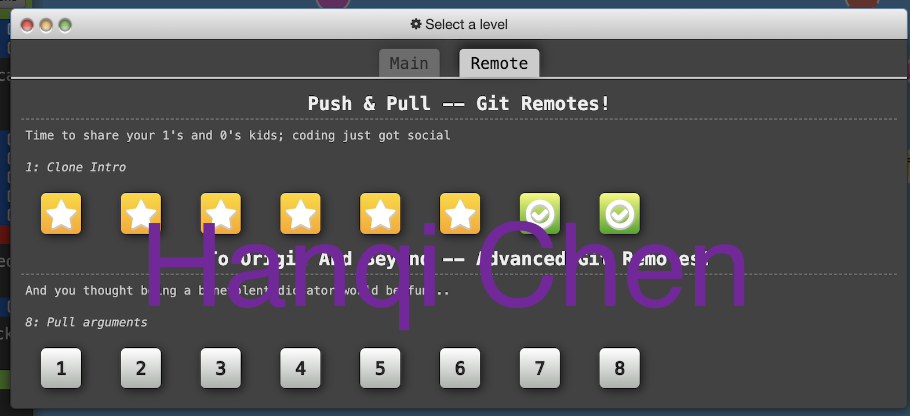

Info\


\
GitHub Activity\


## Introduction
A code repository for learning to use git version control, GitHub Issues and best practices, and so on.

Created as part of homework 2 for CSC 510: Software Engineering.
### Contributors (Group 15)
- Adam Imbert (apimbert)
- Hanqi Chen (hchen54) 
- Krishna Pallavalli (kpallav)

## Image


Hanqi Chen (hchen54):
 
  
<!-- 
 -->

## Code Example
```
# Stage all changes for commit
git add .


# Commit the staged changes with a message
git commit -m "Add changes"


# Push to the remote repository
git push origin YOUR_BRANCH
```

## ✅ Task List
- [ ] Task 1: Complete Git Tutorial
- [ ] Task 2: Add Screenshots to `README.md`
- [ ] Task 3: Modify `.html` File
- [ ] Task 4: Merge Latest Changes
- [ ] Task 5: Review Pull Requests
